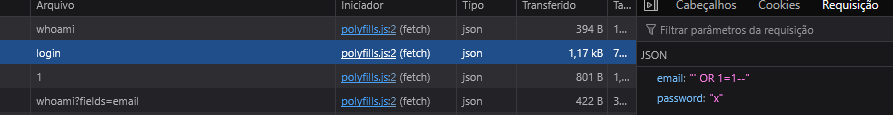
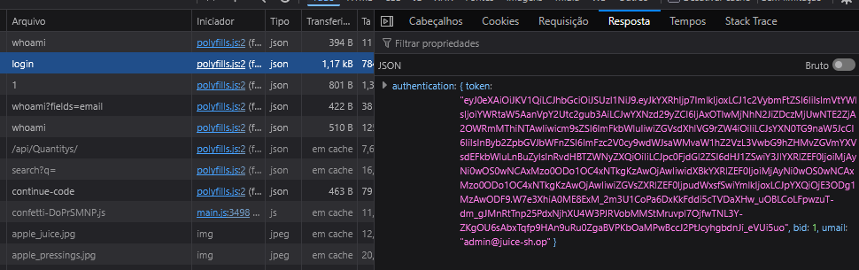
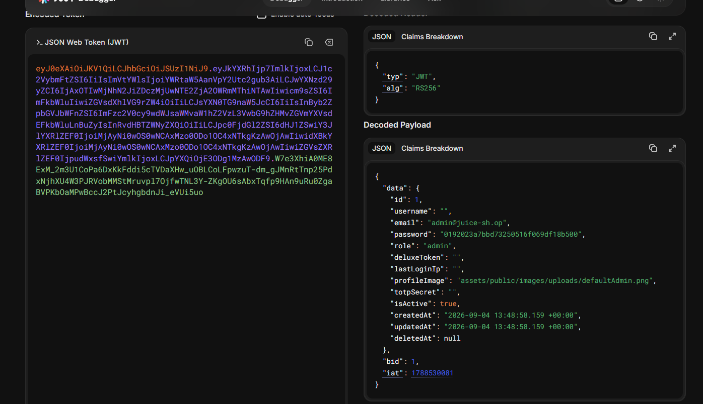
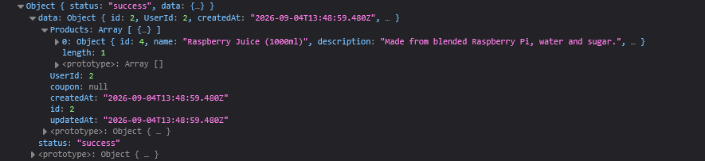

# Evidencias por achado

Duas camadas de evidência, complementares:

1. **Capturas de tela** (arquivos `image*.png`, abaixo), do navegador e do DevTools, mostrando o achado acontecendo visualmente.
2. **Pastas por achado** (`V1-sqli-login/`, `V2-hash-senha-jwt/`, `V3-idor-cesta/`, `V4-erro-verboso-headers/`, `V5-listagem-diretorio-ftp/`), com a requisição e a resposta HTTP completas em texto (`http/NN-request.http` / `NN-response.http`), reproduzíveis por outra pessoa sem depender apenas da imagem. V1–V3 têm script Python correspondente em `scripts/`; V4 e V5 foram capturados via `curl` (documentado em `relatorio/tabela-de-achados.md`).

## Capturas de tela originais (V1–V3)

# Logado como admin via sql injection

# Requisição de login

# Token retornado é

# Código JWT é facilmente lido e pode ser conferido aqui

# Acessando outro carrinho de outro usuário apenas enviando meu token e a requisição

